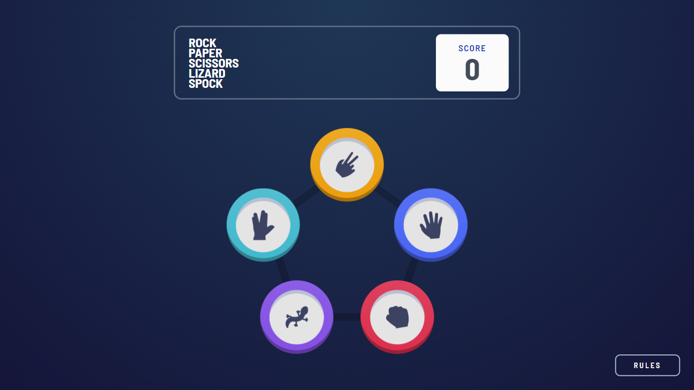
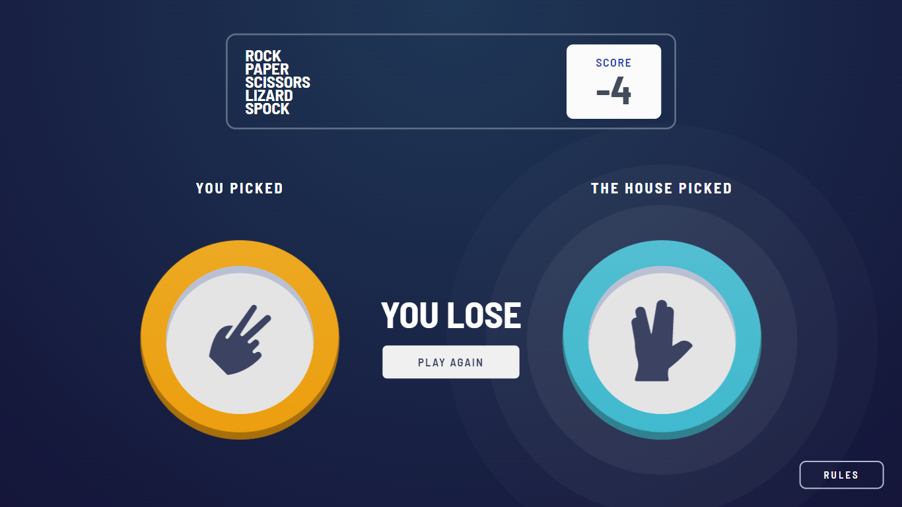
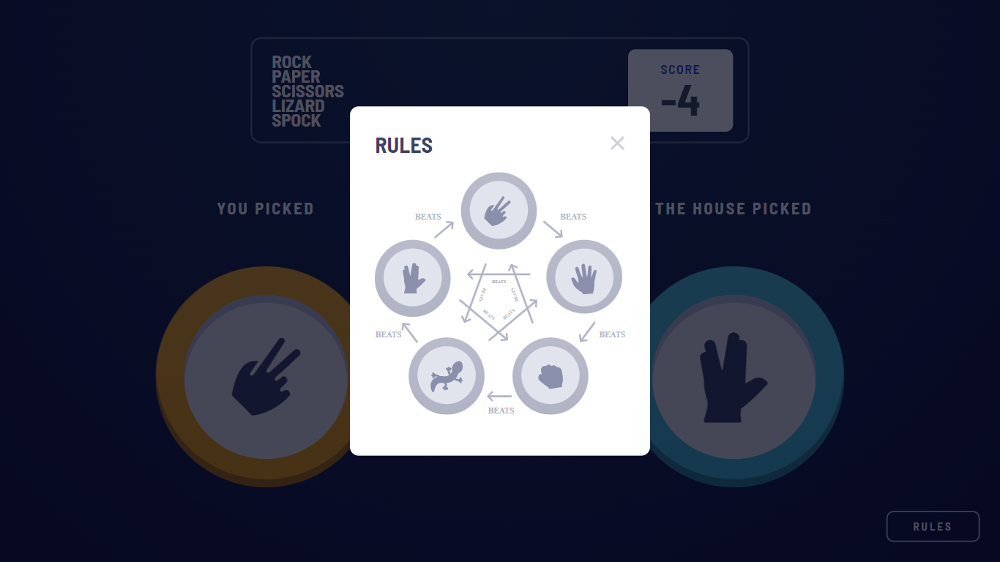

# Frontend Mentor - Rock, Paper, Scissors solution

This is a solution to the [Rock, Paper, Scissors challenge on Frontend Mentor](https://www.frontendmentor.io/challenges/rock-paper-scissors-game-pTgwgvgH). Frontend Mentor challenges help you improve your coding skills by building realistic projects.

## Table of contents

- [Overview](#overview)
  - [The challenge](#the-challenge)
  - [Screenshot](#screenshot)
  - [Links](#links)
- [My process](#my-process)
  - [Built with](#built-with)
  - [Continued development](#continued-development)
- [Author](#author)

## Overview

### The challenge

Users should be able to:

- View the optimal layout for the game depending on their device's screen size
- Play Rock, Paper, Scissors, Lizard, Spock against the computer

### Screenshot

### Links

- Solution URL: [https://github.com/AnshumanMahato/rock-paper-scissors](https://github.com/AnshumanMahato/rock-paper-scissors)
- Live Site URL: [https://anshumanmahato.github.io/rock-paper-scissors/](https://anshumanmahato.github.io/rock-paper-scissors/)

## My process

### Built with

- Semantic HTML5 markup
- SASS
- Flexbox
- CSS Grid
- Desktop-first workflow
- Vanilla Javascript

### Continued development

- Refactoring the CSS and JS code
- Maintain the state of the score after refreshing the browser

## Author

- Frontend Mentor - [@AnshumanMahato](https://www.frontendmentor.io/profile/AnshumanMahato)
- Telegram - [@AnshumanMahato](https://t.me/AnshumanMahato)
